<div align="center">

# Earthquake-Q · Honest Aftershock-Risk Forecasting

**Calibrated 30-day and 6-month earthquake probabilities for the central & eastern United States**

*SC Quantathon V3 · SRNL & Clemson University · Earthquake-Q challenge · Team Schrödinger's Cats · September 2026*


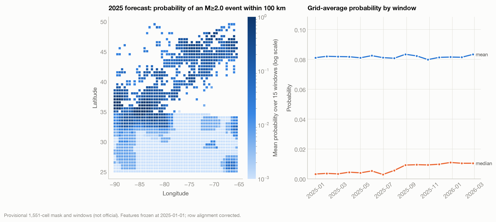

</div>

## What this project does

After a damaging earthquake, rescue crews need to know whether it is safe to enter the damage zone in the next
30 days, and repair crews need a 6-month view. This project answers one question for every cell of a
half-degree grid:

> **What is the probability of at least one M ≥ 2.0 earthquake within 100 km of this cell during each 30-day window?**

It produces **23,265 calibrated probabilities** (1,551 cells × 15 windows, issued 2025-01-01) from raw USGS
catalog data. The pipeline is leakage-safe, checked against physics and simple baselines, and scored once on a
held-out window.

## Results at a glance

| | Test 2021–2023 | **Judge 2025–2026** (held out, used once) |
|---|---:|---:|
| Information gain over climatology | +0.146 bits | **+0.161 bits** |
| ROC AUC | 0.906 | **0.913** |
| Calibration error (ECE, target < 0.02) | 0.0071 | **0.0066** |
| Cell-windows scored | 767,745 | 23,265 |

- **No leakage:** the held-out judge score is *higher* than the test score. A leaking model shows the opposite.
- **Beats location alone:** +0.010 bits over a location-only baseline on the judge window.
- **Ties physics:** statistically level with an ETAS aftershock model (paired 95% CI spans 0), as the challenge's reference solution also found.
- **External drivers don't help:** geomagnetic, solar, tidal and GPS streams add nothing in paired tests.
- **Quantum: no lift, measured properly.** A 4-qubit feature map is used by the model but gives no reliable gain (paired 95% CI).
- **Caught a critical bug:** our first forecast file had misaligned rows and would have scored −0.37 bits. We found it by rerunning everything from raw data, fixed it, and verified the fix independently.

<p align="center">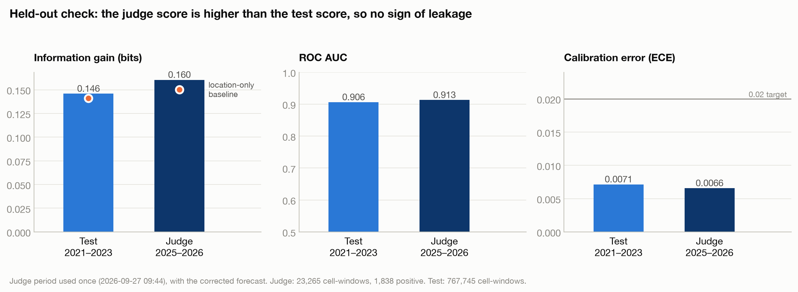</p>

## How it works

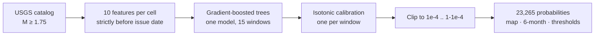

**Training data is built the way the model is scored:** every cell × every monthly issue date × 15 lead
windows, labelled by whether a qualifying quake followed. Features only use events *before* each issue date.
Splits are strictly by time: fit 2001–2018, calibrate 2019–2020, test 2021–2023, judge 2025–2026.

| Component | Choice |
|---|---|
| Features (10) | event counts within 100 km over 7 / 30 / 90 / 365 days, days since last event (log), acceleration ratios 7/30 d and 30/365 d, latitude, longitude, lead window h/14 |
| Model | `HistGradientBoostingClassifier`: 120 trees × 31 leaves, learning rate 0.06, L2 = 1.0, 255 bins, seed 42 |
| Training | 5,025,240 rows; all 120 boosting iterations used (early stopping armed, never triggered); no epochs or batches, since each iteration fits one tree on the full set |
| Calibration | 15 isotonic regressions, one per lead window, fitted only on 2019–2020 |
| Size | 120 trees, 3,720 leaves, ≈ 10,900 learned values |

### Scoring

$$\mathrm{LL}(q) = -\frac{1}{N}\sum_i \big[y_i \ln q_i + (1-y_i)\ln(1-q_i)\big] \qquad
\mathrm{IG} = \frac{\mathrm{LL}(\text{base rate}) - \mathrm{LL}(\text{forecast})}{\ln 2}\ \text{bits}$$

Information gain is the primary metric. Calibration error (ECE) checks that "20%" really means 20%.

## Results in detail

<table>
<tr>
<td width="50%">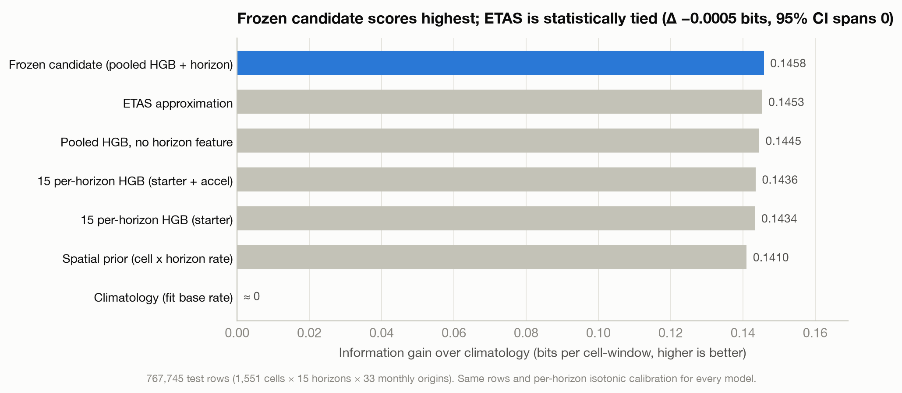<br><sub><b>Model comparison on identical test rows.</b> Our model scores highest; the ETAS approximation is a statistical tie; location alone gets 97% of the way.</sub></td>
<td width="50%">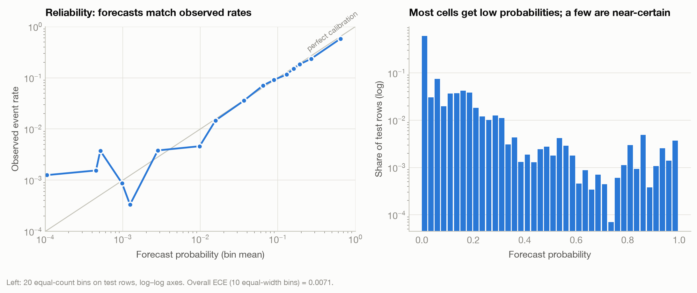<br><sub><b>Calibration.</b> Forecasts above 1% track observed rates closely; ECE 0.0071 on test.</sub></td>
</tr>
<tr>
<td>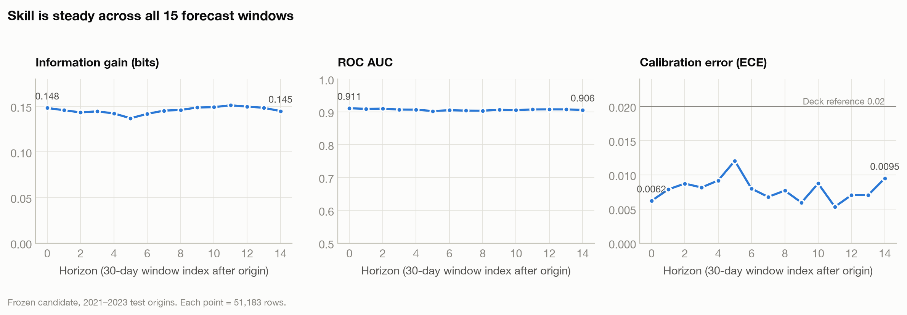<br><sub><b>Skill by lead window.</b> Steady across all 15 windows (0.137–0.151 bits on test).</sub></td>
<td>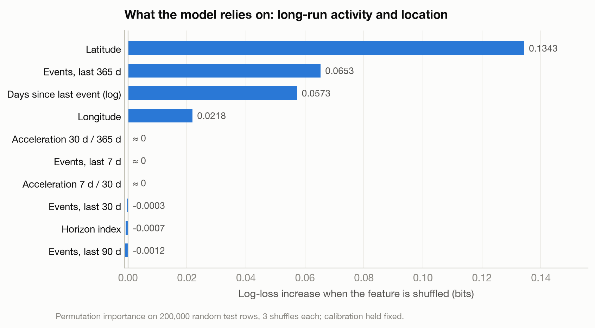<br><sub><b>What drives it.</b> Permutation importance on held-out rows: location and last-year activity.</sub></td>
</tr>
<tr>
<td>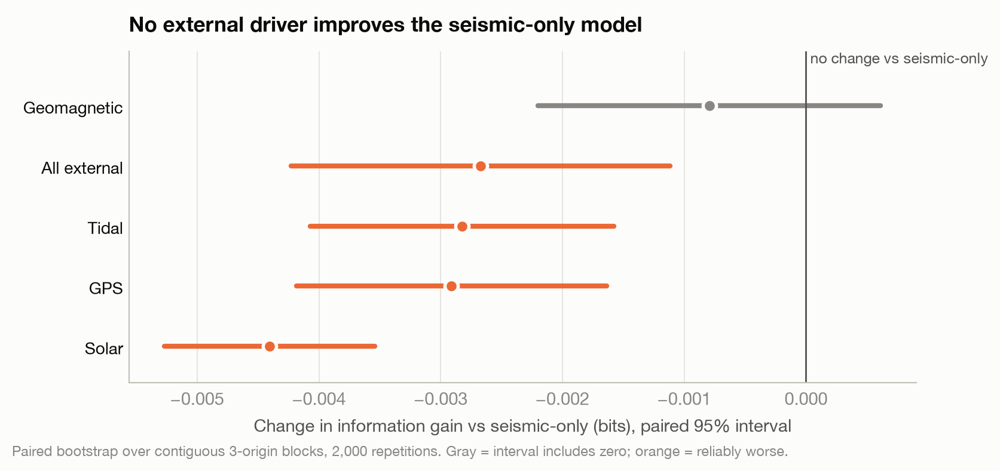<br><sub><b>External drivers.</b> Geomagnetic, solar, tidal and GPS never help; four of five make it reliably worse.</sub></td>
<td>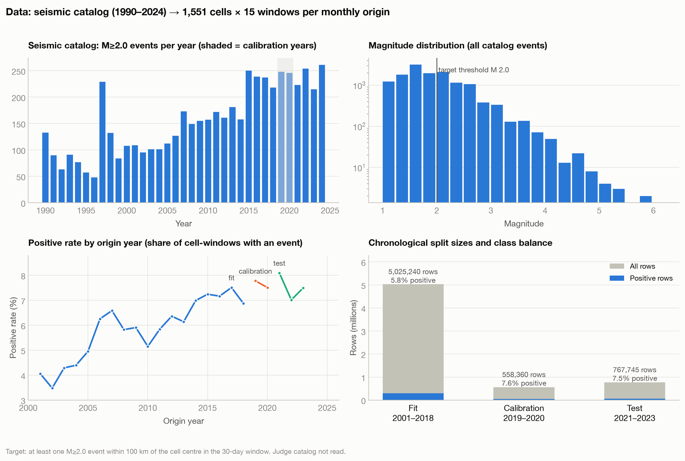<br><sub><b>Data.</b> Catalog activity, magnitudes, event rate by year, and split sizes.</sub></td>
</tr>
</table>

## Quantum experiment

**Why:** entangled circuits can turn combinations of features into new inputs, which a classical model might not
build on its own. It is directly testable: compare the model with and without quantum features on the same rows.

**How:** four time-varying features (365-day count, recency, two acceleration ratios) are angle-encoded with
RY(π·xᵢ) on 4 qubits, entangled with a CNOT ring, re-uploaded, and read out as ⟨Zᵢ⟩ and ⟨ZᵢZᵢ₊₁⟩: 8 quantum
features. The circuit is simulated exactly (verified against Qiskit) and the features are appended to the model.

| | Information gain | ROC AUC |
|---|---:|---:|
| Classical model | 0.1458 bits | 0.9061 |
| Classical + quantum | 0.1449 bits | 0.9060 |
| **Difference, paired 95% CI** | **−0.0009 [−0.0015, −0.0004]** | **−0.0002 [−0.0004, +0.0001]** |

The trees use the quantum features (16% of splits) but they add no reliable generalization. Uncertainty comes from
a paired bootstrap over contiguous blocks of issue dates, so correlated rows stay together.

<p align="center">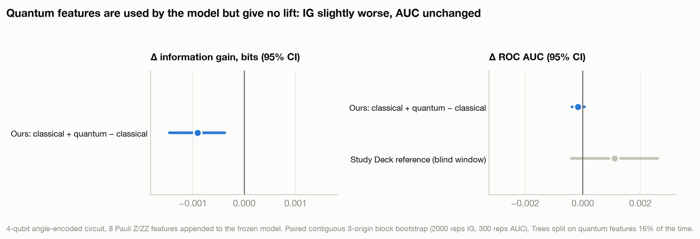</p>

## For decision-makers

- **[Interactive risk map](docs/index.html):** click an epicenter to see the 30-day and 6-month risk for the nearest cell, with that risk band's track record. Enable GitHub Pages on `/docs` to host it.
- **6-month look-ahead** for repair crews: 1 − Π(1 − pₕ) over windows 1–6. On test data it averaged 24.5% forecast vs 22.4% observed (+0.379 bits). It errs on the cautious side where quakes cluster.
- **Entry thresholds** for rescue crews. On test data, clearing cells below a 1% forecast cleared 53% of cell-windows, and 1.3% of events happened there; a 5% cut-off cleared 64% and missed 3.9%. The acceptable level is for emergency managers to choose.

<p align="center">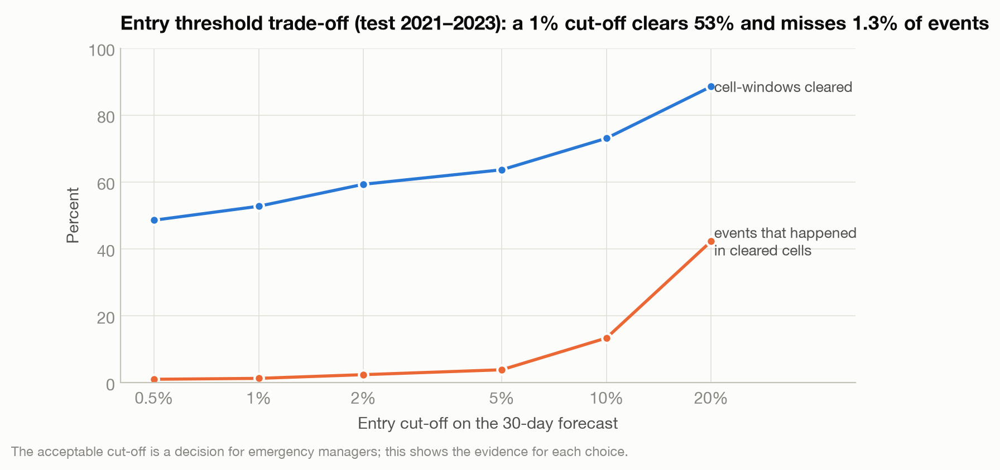</p>

## Quality control

Every recorded result was rerun from the raw catalogs and checked by 19 automated tests
([report](results/reports/SUBMISSION_CHECK.md)):

- ✅ Training data regenerates bit-identically; all headline metrics reproduce exactly
- ✅ Calibration error below 0.02 overall and in every lead-window group
- ✅ Headline pipeline never reads the judge data; the judge set was scored once
- ✅ 200 random forecast rows recomputed with independent code: exact match
- 🔧 Found and fixed a row-alignment bug in the first forecast file (22,163 of 23,265 rows misplaced)

<p align="center">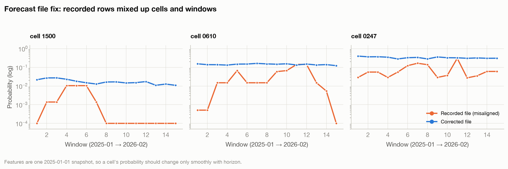</p>

## Project timeline

| Stage | What we did |
|---|---|
| 1 · Audit | Read-only audit of 3 CSVs (337k rows, 5 sources); duplicate and near-duplicate checks; completeness Mc = 1.75 |
| 2 · Baseline | Reproduced the starter notebook; built grid-style training data (cell × issue date × lead window) |
| 3 · Features | Multi-scale counts, recency, acceleration; feature ablations |
| 4 · Physics | ETAS maximum-likelihood fit and declustering diagnostics |
| 5 · Models | Per-window vs pooled boosted trees; MLP comparison; pooled model with lead-window feature selected |
| 6 · Drivers | Geomagnetic, solar, tidal and GPS ablations with paired block bootstrap: excluded |
| 7 · Freeze | Froze the pipeline; full 1,551-cell × 15-window forecast |
| 8 · Verify | Full rerun from raw data, 19 checks, forecast bug found and fixed |
| 9 · Held-out | One judge-window score: +0.161 bits (test +0.146) |
| 10 · Quantum | 4-qubit feature map, paired test with confidence intervals |
| 11 · Stakeholders | 6-month look-ahead, entry thresholds, interactive map |

## Repository layout

```
earthquake-q-forecast/
├── README.md
├── requirements.txt
├── run_all.sh                  # one command: rebuild everything from raw data
├── data/                       # put the three challenge CSVs in data/raw/ (see data/README.md)
├── pipeline/                   # core pipeline: features, models, ETAS, drivers
│   ├── provisional_contract/   # 1,551-cell mask and 15-window table
│   ├── etas_experiment/        # fitted ETAS parameters
│   └── analysis/               # final run, checks, judge score, quantum test, figures, map
├── results/
│   ├── figures/                # 12 figures (captions in results/README.md)
│   ├── tables/                 # 11 CSV tables behind the figures
│   ├── reports/                # final-run log, verification, judge and quantum results
│   └── forecast_2025.csv       # the 23,265-probability forecast
└── docs/                       # interactive map (index.html), results page, slides
```

## Run it

```bash
python3 -m venv .venv && source .venv/bin/activate
pip install -r requirements.txt
# place earthquakeq_train.csv, earthquakeq_test.csv, earthquakeq_judge.csv in data/raw/
./run_all.sh          # about 30 minutes on a laptop; seed 42 makes every number reproducible
```

## Limitations

- Model selection used the 2021–2023 test period; the judge score is the only untouched number.
- The ETAS fit's triggering strength collapsed to about zero, so the ETAS comparison behaves more like a background-rate model. A declustered refit is the natural next step.
- Some labels near split boundaries overlap the next period; removing them costs 0.004 bits on test.
- The 1,551-cell mask and window dates were built from the challenge specification.
- A probability map is not a safety guarantee; thresholds need agreement with emergency managers.

## References

Aki (1965) · Breiman (2001) · Friedman (2001) · Gardner & Knopoff (1974) · Gneiting & Raftery (2007) ·
Grinsztajn et al. (2022) · Guo et al. (2017) · Gutenberg & Richter (1944) · Havlíček et al. (2019) ·
Ke et al. (2017) · Künsch (1989) · McClean et al. (2018) · Mignan & Woessner (2012) · Ogata (1988) ·
Schuld & Killoran (2019) · Thanasilp et al. (2024) · Utsu (1961) · Wiemer & Wyss (2000) · Zadrozny & Elkan (2002).
Full citations are on the last slide of [the presentation](docs/presentation.pptx).

## Acknowledgements

Built by **Team Schrödinger's Cats** at **SC Quantathon V3** (Clemson University, 25–27 September 2026).
Challenge by Larry M. Deschaine, PhD (SRNL & Clemson), sponsored by Savannah River National Laboratory.
Earthquake data: USGS ComCat; driver streams: GFZ (geomagnetic, solar), ephemeris tides, Nevada Geodetic Laboratory (GPS).
